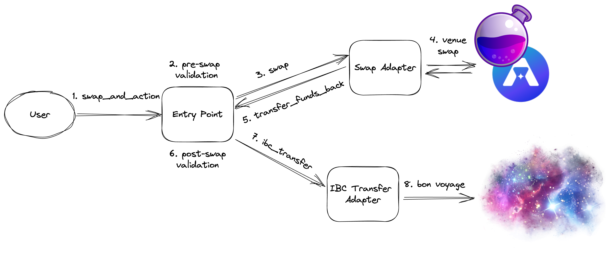

# Skip Go CosmWasm Contracts

The contracts in this repository are used in [Skip Go API](https://docs.skip.build) to enable any-to-any swaps as part of multi-chain workflows.

Skip Go is a unified REST API, Widget, and Core Package that helps developers create more seamless cross-chain experiences for their end users with IBC [(Inter-Blockchain Communication protocol)](https://ibcprotocol.dev/). 

Skip Go API is designed so that even developers who are new to IBC can offer incredible cross-chain experiences, like swaps and transfers between any two IBC-enabled chains and tokens in as few transactions as possible, with reliable multi-chain relaying, packet tracking, and more.

# Overview

The on-chain components of the swapping functionality consist of:
1. A main entry point contract
2. Chain/dex-specific swap adapter contracts 
3. Chain-specific IBC transfer adapter contracts

## Entry Point Contract

The entry point contract is responsible for providing a standardized interface (w/ safety checks) to interact with Skip Swap across all CosmWasm-enabled chains. The contract:
1. Performs basic validation on the call data.
2. If a fee swap is provided, queries the swap adapter contract to determine how much of the coin sent with the contract call is needed to receive the required fee coin(s), and dispatches the swap.
3. Dispatches the user swap provided in the call data to the relevant swap adapter contract.
4. Verifies the amount out received from the swap(s) is greater than the minimum amount required by the caller after all fees have been subtracted (swap, ibc, affiliate).
5. Dispatches one of the following post-swap actions with the received funds from the swap:
    - Transfer to an address on the same chain.
    - IBC transfer to an address on a different chain (which allows for multi-hop IBC transfers or contract calls if the destination chains support it).
    - Call a contract on the same chain.

## Swap Adapter Contracts

Swap Adapter contracts are developed and deployed for each swap venue supported by Skip Swap. The contracts are responsible for:
1. Taking the standardized entry point swap operations message format and converting it to the specific swap venue's format.
2. Swapping by calling the swap venue's respective smart contract or module.
3. Providing query methods that can be called by the entry point contract (generally, to any external actor) to simulate multi-hop swaps that either specify an exact amount in (estimating how much would be received from the swap) or an exact amount out (estimating how much is required to get the specified amount out).

## IBC Transfer Adapter Contracts

IBC Transfer adapter contracts are developed and deployed for each chain supported by Skip Swap. The contracts are responsible for:
1. Dispatching the IBC transfer (with the appropriate IBC fees if required).
2. Failing the entire transaction if the IBC transfer errors on the swap chain (sending the caller back their original funds).
3. Refunding the caller on the swap chain if the IBC transfer errors or times out once it reaches the destination chain (also refunding unused IBC fees).

# Example Flow



A simplified example flow showcasing the interactions between the contracts is as follows:
1. A user calls `swap_and_action` on the entry point contract.
2. The entry point contract performs pre-swap validation checks on the user call.
3. The entry point contract calls `swap` on the relevant swap adapter contract, sending the coin to swap to the swap adapter contract.
4. The swap adapter contract swaps the coin sent by the entry point contract to the desired output denom through the relevant swap venue.
5. The swap adapter contract calls `transfer_funds_back` on itself, which transfers the post-swap contract balance back to the entry point contract.
6. The entry point contract performs post-swap validation checks, ensuring the minimum amount out specified in the original call is satisfied.
7. The entry point contract calls `ibc_transfer` on the IBC transfer adapter contract. 
    - Note: The entry point contract dispatches one of three post swap actions. This simplified example flow is just showing the IBC transfer post swap action.
8. The IBC transfer adapter contract dispatches the IBC transfer. Bon voyage!

# Testing

All tests can be found in the tests folder in each respective contract package.

Run all tests in the repo:
```bash
make test
```

Note: Due to the nature of the adapter contracts using stargate messages and interacting with chain-specific modules, integration testing is conducted on the respective testnets. See Deployment section for deployment instructions.

# Development Processes

The repository's CI is triggered on pull requests and will fail if any error or warnings appear running the `check`, `clippy`, and `fmt` commands found in the Makefile.

Each command and how to run them are as follows:

`cargo check --target wasm32-unknown-unknown` is used to compile the contracts and verify they are valid wasm:
``` bash
make check
```

`clippy` is used for linting:
``` bash
make clippy
```

`rustfmt` is used for formatting:
``` bash
make fmt
```
